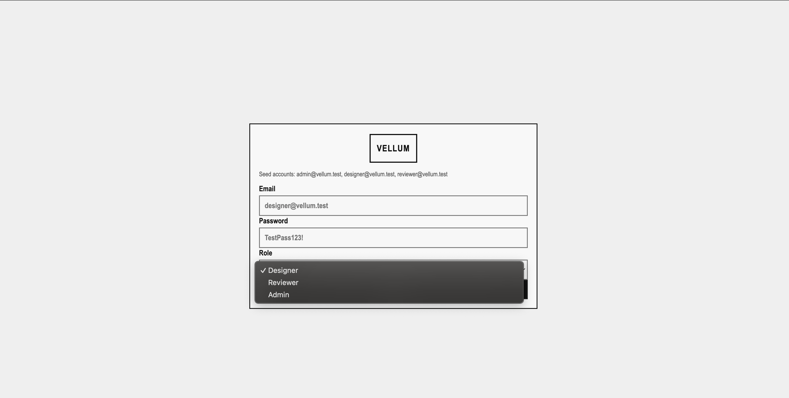

<a name="top"></a>

<div align="center">


**Fast, Mobile-First Digital Asset Review & Approval Platform**

[](assets/docs/sprint-1/achitecture.md)
[](assets/docs/sprint-1/achitecture.md)
[](assets/docs/sprint-1/nonfunctional-requirements.md)
[](assets/docs/sprint-1/functional-requirements.md)
[](assets/docs/sprint-1/nonfunctional-requirements.md)
[](LICENSE)

</div>

---

## Table of Contents
- [About](#about)
- [Key Features](#key-features)
- [Screenshots](#screenshots)
- [Documentation](#documentation)
- [Tech Stack](#tech-stack)
- [Getting Started](#getting-started)
- [Project Team](#project-team)
- [License](#license)

**Documentation Location:** All documentation is organized in `assets/docs/` with core technical docs at the root level and sprint-specific docs in `assets/docs/sprint-{number}/` folders.

---

## About

**Vellum** is a fast, mobile-first digital asset review and approval platform designed for teams that prioritize speed and clarity over bloated tooling. It treats approval as **structured system data** rather than informal comments, enabling clear approval states, auditable decisions, and predictable workflows.

Vellum provides lightweight, role-aware creative reviews optimized for real-world usage, especially on mobile devices, without the complexity or cost of traditional enterprise solutions.

### Why Vellum?

- **Mobile-First:** Complete workflows in 3 taps or fewer on any device
- **Structured Approvals:** Clear approval states, not just comments
- **Role-Based:** Designer, Reviewer, and Admin roles with proper access control
- **Fast:** File lists load in under 2 seconds, approval actions complete in 500ms
- **Anti-Bloat:** Lightweight architecture without enterprise complexity

---

## Key Features

**Structured Approval Workflow**
- Clear approval states (Pending, Approved, Changes Requested)
- Auditable decision history
- Role-based approval permissions

**Mobile-First Design**
- Complete review workflows on mobile devices
- Responsive UI optimized for touch interactions
- Fast load times on mobile networks

**Role-Based Access Control**
- **Designer/Contributor:** Upload files and track approval status
- **Creative Reviewer:** Review files, provide feedback, approve/request changes
- **Admin/Project Owner:** Manage users, roles, and project settings

**Multi-Format File Support**
- Images, PDFs, Office documents
- Text, code files, CSV, JSON
- Archive files (ZIP) and more

**Contextual Feedback**
- Comment on files with approval context
- Version history tracking
- Clear visual approval indicators

---

## Screenshots

### Login Page with Backend Integration

The login page demonstrates the full-stack connection with seeded-account workflow support:

<div align="center">



*Login page for seeded role accounts (Designer, Reviewer, Admin)*

</div>

This screenshot shows:
- Frontend React application running
- Backend connected to PostgreSQL database
- Complete data flow: Database -> Backend -> Frontend -> UI

---

## Documentation

### Core Documentation

- **[Elevator Pitch](assets/docs/sprint-1/elevator-pitch.md)** - Project vision and value proposition
- **[Architecture](assets/docs/sprint-1/achitecture.md)** - System architecture and technology stack
- **[Functional Requirements](assets/docs/sprint-1/functional-requirements.md)** - Core system capabilities
- **[Non-Functional Requirements](assets/docs/sprint-1/nonfunctional-requirements.md)** - Performance, usability, and quality metrics

### Design & Planning

- **[Personas](assets/docs/sprint-1/personas.md)** - User personas and target audience
- **[Use Cases](assets/docs/sprint-1/use-cases.md)** - Key user scenarios and workflows
- **[Figma Wireframes](assets/docs/sprint-1/figma-wireframe.md)** - UI/UX design mockups
- **[Sequence Diagrams](assets/docs/sprint-1/sequence-diagrams.md)** - System interaction flows

### Technical Specifications

- **[API JSON Contracts](assets/docs/sprint-1/api-json-contracts.md)** - RESTful API endpoint specifications
- **[Database Diagram](assets/docs/sprint-1/database-diagram.md)** - Database schema and relationships

### Testing

- **[Testing Plan (Whitebox)](assets/docs/sprint-1/testing-plan-whitebox.md)** - Unit and integration testing strategy
- **[User Acceptance Test Plan](assets/docs/sprint-1/user-acceptance-test-plan.md)** - UAT scenarios and acceptance criteria

### Project Management

- **[Project Follow-up](assets/docs/project-management/project-follow-up.md)** - Sprint review and status tracking
- **[Schedule](assets/docs/project-management/schedule.md)** - Project timeline and milestones
- **[Sprint 1 Review Checklist](assets/docs/project-management/sprint1-review-checklist.md)** - Review preparation checklist

---

## Tech Stack

**Frontend**
- React (mobile-first web application)
- Component-based UI architecture
- Responsive design for all screen sizes

**Backend**
- Node.js with Express
- RESTful API architecture
- Token-based authentication

**Database**
- PostgreSQL (relational database)
- Optimized for approval workflow queries

**Authentication & Authorization**
- Role-Based Access Control (RBAC)
- Secure token-based authentication
- Three-tier permission system

---

## Getting Started

This guide will walk you through setting up the Vellum development environment from scratch.

### Prerequisites

Before you begin, ensure you have the following installed:

- **Node.js** (v18.0 or higher) - [Download](https://nodejs.org/)
- **PostgreSQL** (v14 or higher) - [Download](https://www.postgresql.org/download/)
- **Git** - [Download](https://git-scm.com/)
- **npm** (comes with Node.js) or **yarn**

### Step 1: Clone the Repository

```bash
# Clone the repository
git clone https://github.com/jjacobsonn/CS4900.git

# Navigate to project directory
cd CS4900
```

### Step 2: Install Dependencies

```bash
# Install all workspace dependencies
npm install
```

### Step 3: Set Up PostgreSQL Database

#### 3.1 Create Database

Using PostgreSQL command line (`psql`):

```bash
# Connect to PostgreSQL (as superuser or database owner)
psql -U postgres

# Create the database
CREATE DATABASE vellum;

# Connect to the new database
\c vellum;
```

Or using a GUI tool like pgAdmin:
1. Open pgAdmin
2. Right-click on "Databases"
3. Select "Create" → "Database"
4. Name it `vellum`
5. Click "Save"

#### 3.2 Run Database Setup Script

From the project root directory:

```bash
# Preferred project command
npm run init-db

# Equivalent direct psql command
psql -U postgres -d postgres -f database/setup.sql
```

The setup script will:
- Create all required tables (users, files, file_versions, comments, approval_history)
- Create normalized lookup tables (user_roles, approval_statuses)
- Insert default/initial records (roles and statuses)
- Create indexes for performance
- Set up triggers for automatic timestamp updates

#### 3.3 Verify Database Setup

```bash
# Connect to database
psql -U postgres -d vellum

# Verify tables were created
\dt

# Verify lookup data was inserted
SELECT * FROM user_roles;
SELECT * FROM approval_statuses;
```

### Step 4: Configure Environment Variables

Create a `.env` file in the backend directory (create `.env.example` first if it doesn't exist):

```bash
# Backend .env file
# Database Configuration
DB_HOST=localhost
DB_PORT=5432
DB_NAME=vellum
DB_USER=postgres
DB_PASSWORD=your_postgres_password

# Server Configuration
PORT=3000
NODE_ENV=development

# JWT Secret (generate a secure random string)
JWT_SECRET=your_jwt_secret_key_here

# File Upload Configuration
UPLOAD_DIR=./uploads
MAX_FILE_SIZE=10485760  # 10MB in bytes
```

### Step 5: Start Server Components

#### 5.1 Start PostgreSQL (if not running)

**macOS:**
```bash
brew services start postgresql
# or
pg_ctl -D /usr/local/var/postgres start
```

**Linux:**
```bash
sudo systemctl start postgresql
```

**Windows:**
PostgreSQL typically runs as a service automatically.

#### 5.2 Start Backend + Frontend Together (Recommended)

```bash
# From project root
npm start
```

#### 5.3 Start Services Separately (Optional)

Backend:

```bash
cd backend
npm start
```

Frontend:

```bash
cd frontend

# Start React development server (Vite)
npm run dev
```

Frontend GUI will be available at: **http://localhost:5173** (Vite default port)

### Step 6: Verify Installation

1. **Database:** Verify tables exist and lookup data is populated
2. **Backend:** Check that server starts without errors
3. **Frontend:** Verify React app loads in browser
4. **API Connection:** Test API endpoints (when implemented)

### Default URLs

- **Backend API:** http://localhost:3000/api
- **Backend Health Check:** http://localhost:3000/api/health
- **User Roles API:** http://localhost:3000/api/user-roles
- **Frontend GUI:** http://localhost:5173 (Vite dev server)

### Troubleshooting

**Database Connection Issues:**
- Verify PostgreSQL is running: `pg_isready` or `psql -U postgres -c "SELECT 1;"`
- Check database credentials in `.env` file
- Ensure database `vellum` exists

**Port Already in Use:**
- Change `PORT` in `.env` file
- Or stop the process using the port: `lsof -ti:3000 | xargs kill`

**Module Not Found Errors:**
- Run `npm install` in both `backend/` and `frontend/` directories
- Delete `node_modules` and `package-lock.json`, then reinstall

For detailed architecture information, see the [Architecture documentation](assets/docs/sprint-1/achitecture.md).

---

## Project Team

**Course:** CS 4900 - Senior Capstone Project  
**Institution:** Utah Valley University  
**Term:** Spring 2026

This project is being developed as part of the UVU Computer Science capstone program.

---

## Feedback and Contributions

We're continuously improving Vellum based on real-world usage and feedback. Whether you have suggestions for features, have encountered bugs, or want to contribute to the codebase, we'd love to hear from you.

Please feel free to:
- [Submit an issue](https://github.com/jjacobsonn/CS4900/issues)
- [Start a discussion](https://github.com/jjacobsonn/CS4900/discussions)
- Submit a pull request

---

## License

This project is developed for academic purposes as part of the UVU CS 4900 capstone course.

---

**Vellum** - Approval workflows, reimagined for mobile.

[Back to top](#top)
